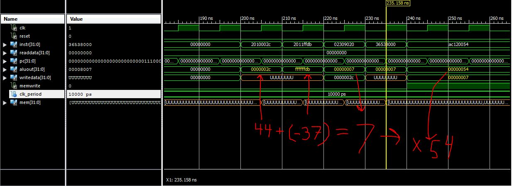
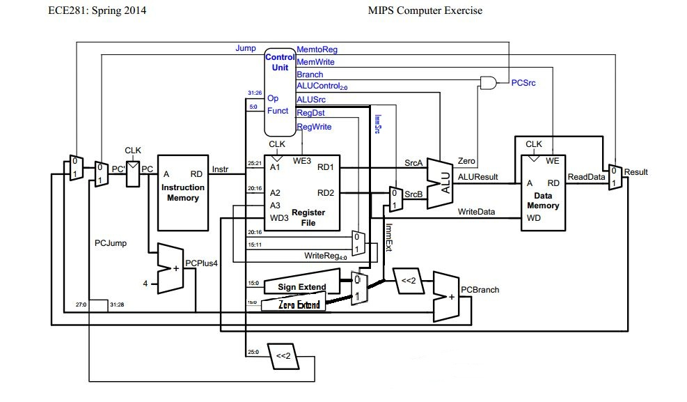
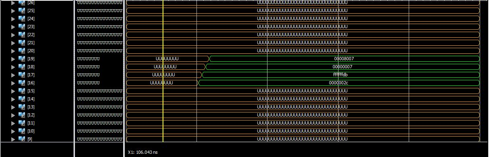

ECE281_CE5
==========

MIPS for days

##Task 1

```
# MIPS task one which initializes two registers, adds them, and stores the result to memory
# C3C Bodin

main:
      addi      $s0,$0,44 # Load Register $s0 with 44
      addi      $s1,$0,-31 # Load Register $s1 with -31
      add       $s2,$s1,$s0 # Put the result of $s1 + $s0 in $s2
      sw        $s2, 54($0) # Store $s2 to 0 + and offset of 54 i.e. x54
      
```

##Task 2

```
# MIPS task one which initializes two registers, adds them, and stores the result to memory
# C3C Bodin

main:
      addi      $s0,$0,44 # 0x2010002C
      addi      $s1,$0,-31 # 0x2011FFE1
      add       $s2,$s1,$s0 # 0x02309020
      sw        $s2, 84($0) # 0xAC120054
      
```

For some reason I just COULD NOT get the given wave form file. I've included the default wave form with
the radix changed for readability and annotated to show a working program. Note that I misread the assignment
and initialized $s1 with -31 instead of -37. The waveform shows a code that is correct for data. I also ammended
the sw instuction. I needed to add 84 to get x54 as my address in memory. The waveform has not been updated. 



As annotated on the waveform, the ALU out first held 44, then -31, and finally the result of 44+(-31) which is 13. 
Then the ALU out bus held the memory location 36 (CFD) and writedata held 13 which is exactly what we wanted.

##Task 3

###Main Decoder Modification
1. I added the opcode 001101 which is the opcode for ORI in the text.
2. I added another bit to the control signal for immsrc.
3. I added immsrc which is a control signal for the extmux (Extend Multiplexer) which selects between sign and zero extend
```
architecture behave of maindec is
  signal controls: STD_LOGIC_VECTOR(9 downto 0);
begin
  process(op) begin
    case op is
      when "000000" => controls <= "0110000010"; -- Rtype
      when "100011" => controls <= "0101001000"; -- LW
      when "101011" => controls <= "0001010000"; -- SW
      when "000100" => controls <= "0000100001"; -- BEQ
      when "001000" => controls <= "0101000000"; -- ADDI
	when "001101" => controls <= "1101000011"; -- ORI
      when "000010" => controls <= "0000000100"; -- J
      when others   => controls <= "----------"; -- illegal op
    end case;
  end process;
  
  immsrc   <= controls(9);
  regwrite <= controls(8);
  regdst   <= controls(7);
  alusrc   <= controls(6);
  branch   <= controls(5);
  memwrite <= controls(4);
  memtoreg <= controls(3);
  jump     <= controls(2);
  aluop    <= controls(1 downto 0);
end;
```

###ALU Modification
1. I added the fourth case "11" to aluop which primes the ALU for the logical or operations
```
architecture behave of aludec is
begin
  process(aluop, funct) begin
    case aluop is
      when "00" => alucontrol <= "010"; -- add (for lb/sb/addi)
      when "01" => alucontrol <= "110"; -- sub (for beq)
	when "11" => alucontrol <= "001"; -- ORI
      when others => case funct is         -- R-type instructions
                         when "100000" => alucontrol <= "010"; -- add (for add)
                         when "100010" => alucontrol <= "110"; -- subtract (for sub)
                         when "100100" => alucontrol <= "000"; -- logical and (for and)
                         when "100101" => alucontrol <= "001"; -- logical or (for or)
                         when "101010" => alucontrol <= "111"; -- set on less (for slt)
                         when others   => alucontrol <= "---"; -- should never happen
                     end case;
    end case;
  end process;
end;
```

###Schematic modification
This schematic shows the implementation of zero extend and the connection of immSrc


###Functionality
This waveform shows values stored in the registers $s0 through $s3. The code implemented adds 44 to $s0, adds
-37 to $s1, adds $s0 and $s1 and stores the result to $s2, ORs $s2 and x8000 and stores the result in $s3, and finally stores $s2 to x54. 

Below is the code:

```
      -- insert stimulus here 

		instr <= X"2010002C";
		wait for clk_period;
		
		instr <= X"2011FFDB";
		wait for clk_period;
		
		instr <= X"02309020";
		wait for clk_period;
		
		instr <= X"36538000";
		wait for clk_period;
		
		instr <= X"AC120054";
		wait for clk_period;

```



Mips performed the calculations correctly

$s0 = 44+0 = 44 = x0000002c

$s1 = -37+0 = -37 = xFFFFFFDB

$s2 = 44+(-37) = $s0+$s1 = 7 = x00000007

$s3 = x8000 or x7 = x8000 or $s2 = x00008007

